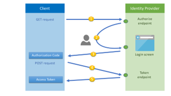
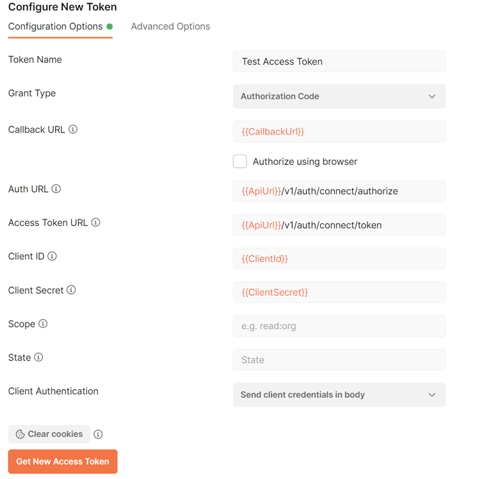
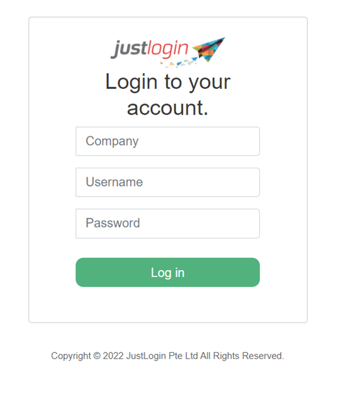
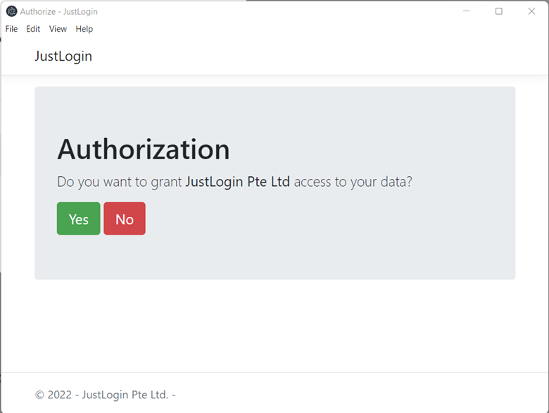
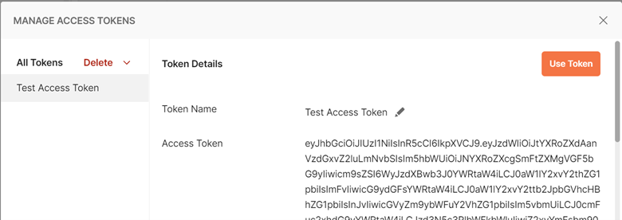

In order to gain access to the API endpoints you first need to be authenticated. Authentication to the APIs is performed using a bearer token which is passed in the Authorization header as shown below.
```
-H "Authorization: Bearer {{access_token}}"
```

## OAuth

We offer access to our API via industry standard OAuth 2.0, allowing you to connect with your JustLogin data easily. To begin you will need to request access to our API. You can do so by reaching out to our support team and briefly explaining what you will be using our API for. Once approved we will provide you with a unique `Client Id` and `Client Secret` for you to use in the standard OAuth 2.0 specification flow. 

## Authenticating

### Interactive Clients

This is the most common type of client scenario: web applications, SPAs or native/mobile apps with interactive users.

### Authorization Code Flow

For this type of clients, the authorization code flow was designed. That flow consists of two physical operations:

- A front-channel step via the browser where all “interactive” things happen, e.g. login page, consent etc. This step results in an authorization code that represents the outcome of the front-channel operation.
- A back-channel step where the authorization code from step 1 gets exchanged with the requested tokens. Confidential clients need to authenticate at this point.



This authentication flow starts with the user clicking a link in the partners application to initiate the authentication process. This will require the Client Id and Client Secret to be passed to the authorization server securely.

The user will be prompted to enter their Company Id, Username and Password and authenticate.

Once authentication is successful, an access_token will be returned to the calling application. This access_token can now be used to access the JustLogin API resources.

**Access Token Lifetime**

For security reasons, the lifetime of an access token is short, usually 1 hour. You can check how long a token will be valid for via the expires_in value returned with the token. This value is in seconds.

### Refresh Tokens

The Access Token response will also include a refresh_token. Because a refresh token has a much longer lifetime it can be used to obtain another access token with a POST call to the token endpoint.

```
POST /v1/auth/connect/token
Content-Type: application/x-www-form-urlencoded 
Authorization: Bearer {{access_token}}
grant_type=refresh_token&refresh_token={{RefreshToken}}&client_id={{ClientId}}&client_secret={{ClientSecret}}
```

**Resource Availability**

Every user within JustLogin can have one or more roles. The roles which are assigned to the user will define what data that user can access.

### Authorization Code Flow Postman Example

Below is an example of using Authorization Code Flow to obtain an Access Token using Postman.

Create a new Postman Request and click the Authorization tab. Select OAuth 2.0 from the Type dropdown list and fill in the form details as follows.



Once the form is complete, press Get New Access Token.

| Input | Description |
| ----------- | ----------- |
| `Token Name` | You can generate multiple tokens in Postman, give this token a unique name. |
| `Callback URL` | When registering with JustLogin you will need to provide a callback URL which we will whitelist and check during token generation. |
| `Auth URL | This is the URL to the authorize endpoint of our identity server. `https://apis.justlogin.com/v1/auth/connect/authorize` |
| `Access Token URL | This is the URL to the token endpoint of our identity server. `https://apis.justlogin.com/v1/auth/connect/token` |
| `Client ID` | This is a unique ID given to all JustLogin partners. |
| `Client Secret` | This is a corresponding secret to the Client ID. |
| `Scope` | openid |
| `State` | Currently not being used. |
| `Client Authentication` | Send client credentials in body |

Next you will be presented with the JustLogin authentication window were you can enter your login details.



Once you have logged in you will be presented with an consent page asking you to confirm the connection, click Yes.



Postman will now show you the response given from our Identity Server which will include the `access_token` and `refresh_token`. You can now use this access_token to access our API endpoints.

